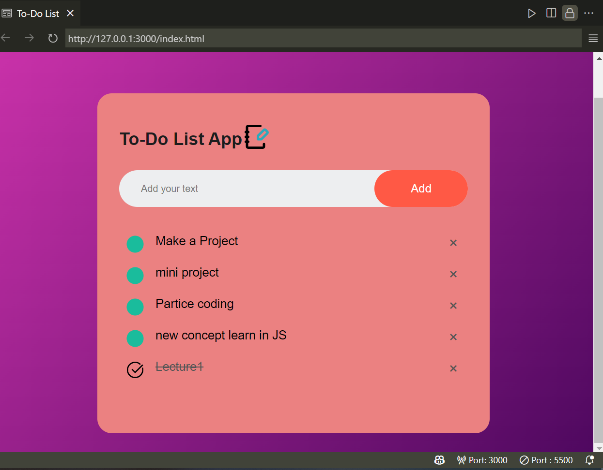

# 📝 To-Do List App

A responsive and user-friendly **To-Do List Web App** built using **HTML**, **CSS**, and **JavaScript**. This simple yet elegant task manager allows users to keep track of their daily activities with ease.

---

## 📸 Preview

 <!-- Replace with your own image path -->

---

## 🚀 Features

✅ **Add Tasks**  
Quickly input new tasks and see them appear instantly in your list.

🗑️ **Delete Tasks**  
Remove individual tasks by clicking the ❌ button.

✔️ **Mark as Completed**  
Click on a task to toggle its completion status (with a line-through and a check icon).

💾 **Local Storage Support** *(optional if implemented)*  
Tasks persist even after reloading the page using browser local storage.

🎨 **Modern Design**  
Styled using gradient backgrounds, rounded elements, and responsive layout.

---

## 🛠️ Technologies Used

| Tech         | Description                         |
|--------------|-------------------------------------|
| 🌐 HTML5     | Markup for app structure             |
| 🎨 CSS3      | Styling including gradients & icons  |
| ⚙️ JavaScript | DOM manipulation and interactivity   |

---

## 📂 Project Structure

```

📁 project-folder/
│
├── 📄 index.html         # Main HTML file
├── 🎨 style.css          # Styling of the app
├── ⚙️ script.js          # JavaScript logic
└── 📷 screenshot.png     # Preview image (for GitHub)

```

---

## 📌 How It Works

1. **User enters a task** in the input field and clicks the **Add** button.
2. The task is **added to the list** and displayed dynamically.
3. Clicking on a task toggles the `checked` class:
   - Adds `line-through` style
   - Changes the SVG circle icon (from empty to checked).
4. Clicking the ❌ icon (a span element) **removes** that task.
5. Tasks are handled using JavaScript DOM manipulation.

---

## 🧠 What You’ll Learn

If you're a beginner exploring this code, you'll learn how to:

- Handle DOM events using JavaScript
- Style with gradients and icon backgrounds
- Use `::before` pseudo-elements and embedded SVGs
- Structure components with clean HTML/CSS/JS separation

---

## 🔗 Live Demo

➡️ [View Live App](https://your-deployment-link.com) <!-- Replace with actual link -->
